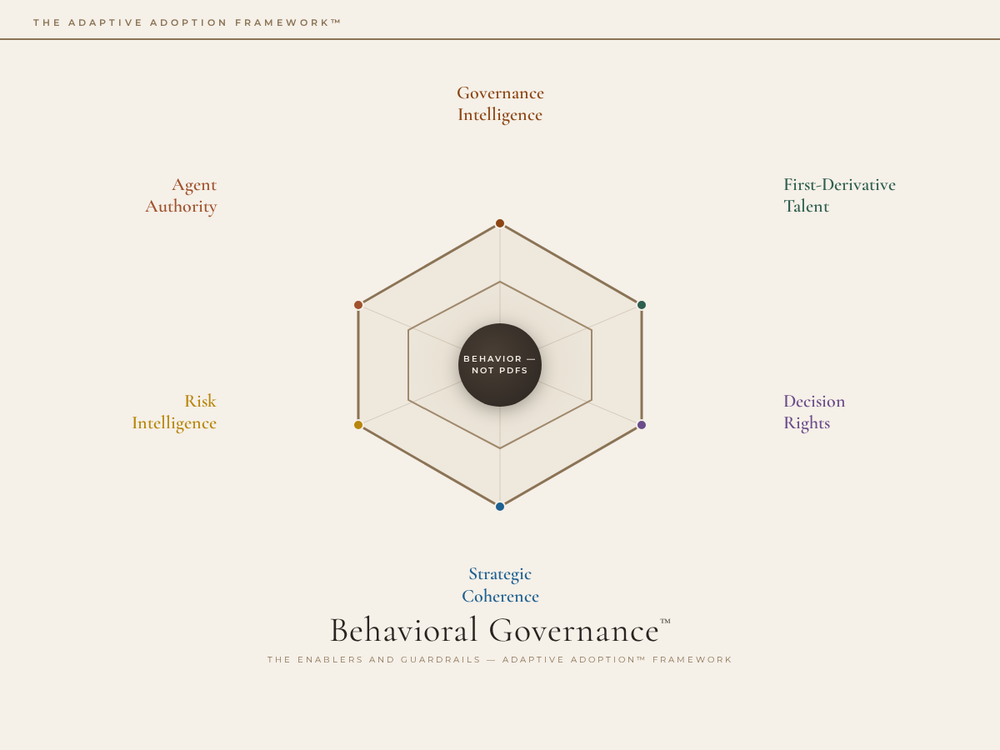

# Behavioral Governance — The Guardrails

**Discipline 3 of 3 · Six dimensions · How the organization governs AI use**

Behavioral Governance replaces compliance-first governance with enacted governance — governance that lives in what people do, not what policies say. Every dimension is assessed via a three-layer protocol: **Self-Report → Evidence → Behavioral Observation**.

The distinction matters: organizations routinely score themselves as "governed" on self-report measures while exhibiting ungoverned behavior in practice. This discipline closes that gap.

---

## The Six Dimensions

| # | Dimension | Focus |
|---|---|---|
| 1 | **[Decision Rights](pillars/01-decision-rights/)** | Who decides what, with what authority, under what constraints |
| 2 | **[Agent Authority](pillars/02-agent-authority/)** | How autonomous AI agents are authorized, bounded, and supervised |
| 3 | **[Risk Intelligence](pillars/03-risk-intelligence/)** | Dynamic risk sensing, not static risk registers |
| 4 | **[Governance Intelligence](pillars/04-governance-intelligence/)** | Board-level readout on AI governance maturity |
| 5 | **[1st-Derivative Talent](pillars/05-first-derivative-talent/)** | The rate of capability change, not the snapshot |
| 6 | **[Strategic Coherence](pillars/06-strategic-coherence/)** | Alignment between AI strategy, business strategy, and governance |

---

## The Five Dials

Behavioral Governance tracks five organizational signals:

1. **Utilization Depth** — How deeply AI is embedded in core workflows
2. **Capability Expansion Rate** — The speed of skill acquisition
3. **Trust Stability** — Whether trust in AI systems is calibrated or volatile
4. **Iteration Velocity** — How fast the organization learns from AI deployments
5. **Leadership Delta** — The gap between current and required leadership capability

---

## Unique to This Discipline

- **[Dashboard](dashboard/)** — Board-level governance readout
- **[Tools](tools/)** — Risk register, audit templates, governance instruments
- **[Behaviors](behaviors/)** — Governance behavioral norms and standards
- **[Model Cards](model-cards/)** — Visual reference cards for each dimension

---

## Three-Layer Assessment Protocol

Every dimension is assessed at three levels of evidence:

1. **Self-Report** — What people say they do (surveys, interviews)
2. **Evidence** — What artifacts and systems show (logs, documentation, audit trails)
3. **Behavioral Observation** — What people actually do (observed practice, enacted behavior)

The gap between layers 1 and 3 is the governance maturity signal.

---

See [99_PROVENANCE.md](99_PROVENANCE.md) for intellectual lineage.
