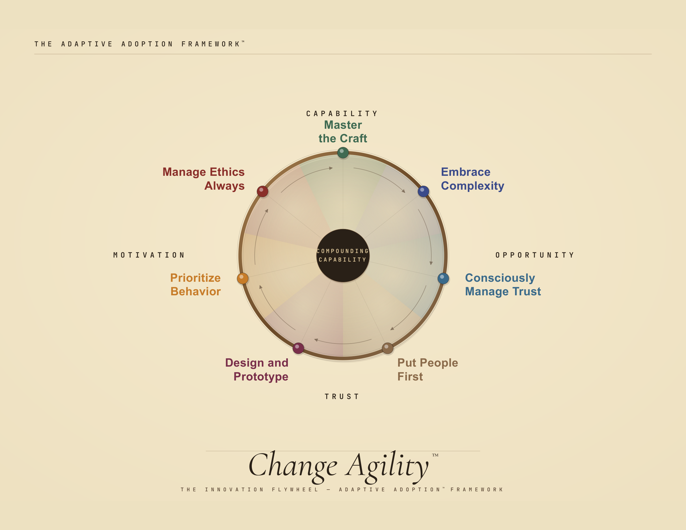
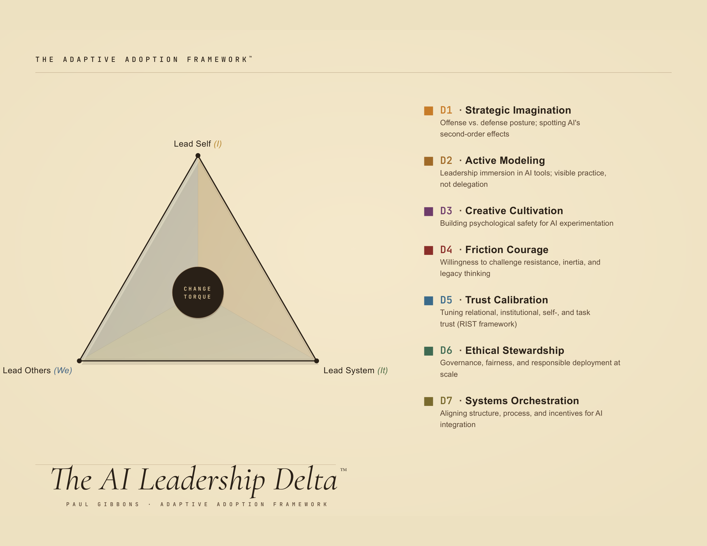
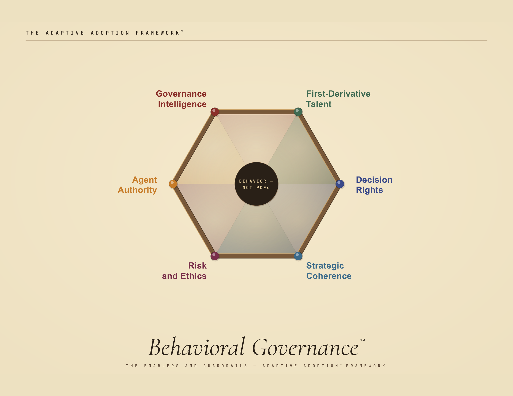

# Framework diagrams and presentation assets

## Current website diagrams

These are the diagrams published on the three discipline pages, retrieved on 6 September 2026. Click an image to open the full-resolution PNG.

### Change Agility™

### Leadership Delta™

### Behavioral Governance™

## Earlier presentation assets

The other diagrams, PDFs, and HTML files in this directory predate this synchronization. They are retained as earlier assets and have not been certified against the current website wording. For a current full publication to share, use the [published whitepapers](../publications/README.md).
